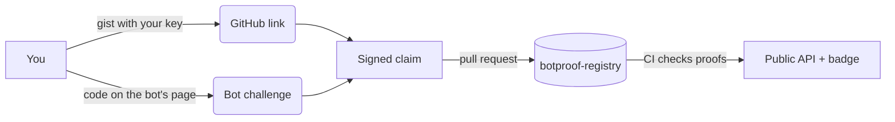

# botproof

**Know who made the bot.** Signed, checkable identity for AI agents, anchored on a real creator.

Anyone can copy a bot and call it theirs. botproof lets a creator prove who they are, prove they control the bot, and collect reviews from people who can be traced too. Everything is signed and kept in a public git registry. No server, no account, no fees.


## How it works



## Try it

Needs Node 22 and the GitHub CLI (`gh`).

```bash
npm i -g github:ao3575911/botproof
botproof init --bot https://x.ai/bot/<id> --name "My Bot"
botproof link github <you>                 # prints a line to put in a public gist
botproof link github <you> --proof <gist-url>
botproof challenge                         # prints a code: add it to the bot's description,
                                           # then update its share template
botproof sign && botproof publish          # opens a PR to the registry
botproof verify grok/<bot-id>
```

Other platforms: `botproof init --platform <name> --bot <id>` and `botproof challenge --url <bot's public page>`. Link more accounts with `botproof link x <post-url>` or `botproof link dns <domain>`.

Review someone else's bot with `botproof attest <platform>/<bot-id> --tag reviewed`. Withdraw anything you signed with `botproof revoke <hash>`.

## What the labels mean

| Label | Meaning |
|---|---|
| **self-claimed** | Signed by the creator, but bot control is not proven |
| **challenge-passed** | The bot's public page showed the creator's one-time code |
| **platform-signed** | The platform signed a request the bot made to the creator's code URL ([Web Bot Auth](https://datatracker.ietf.org/doc/draft-meunier-web-bot-auth-architecture/)) |
| **revoked** | The signer withdrew it |

The score shows its parts: identity (linked accounts), ownership (the label) and reviews (weighted by each reviewer's own trust). Self-reviews don't count.

"Identity linked" means we know who made it. It does not mean the bot is safe.

Registry and API: [ao3575911/botproof-registry](https://github.com/ao3575911/botproof-registry). MIT licence.
