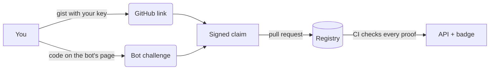

# botproof

**Know who made the bot.** Signed, checkable creator identity for AI agents, verifiable by anyone in one command.

[](https://github.com/ao3575911/botproof/actions/workflows/ci.yml) [](https://github.com/ao3575911/botproof/releases) [](LICENSE) [](RELEASING.md) 

Anyone can copy a bot and call it theirs. botproof lets a creator prove who they are, prove they control the bot, and collect reviews from people who can be traced too. Everything is signed and kept in a [public git registry](https://github.com/ao3575911/botproof-registry). No server, no account, no fees.



## Claim your bot

Needs Node 22+ and the GitHub CLI.

```bash
npm i -g https://github.com/ao3575911/botproof/releases/download/v0.3.1/botproof-0.3.1.tgz
# or straight from GitHub: npm i -g github:ao3575911/botproof
# (npx botproof once it's on npm)
botproof init --bot https://x.ai/bot/<id> --name "My Bot"
botproof link github <you>                   # put the printed line in a public gist
botproof link github <you> --proof <gist-url>
botproof challenge                           # add the printed code to the bot's description
botproof sign && botproof publish            # opens a PR; CI verifies it
```

## Check a bot

```bash
botproof verify grok/<id> --min-strength challenge-passed
```

```yaml
- uses: ao3575911/botproof@v0.3.1
  with: { bot: grok/<id>, min-strength: challenge-passed }
```

| Label | Means |
|---|---|
| **✓ platform-signed** | Challenge passed, and an allowlisted platform signed a request from the bot |
| **✓ challenge-passed** | The bot's own page shows the creator's bound code |
| **✓ verified creator** | The creator is proven; control of this bot isn't |
| **revoked** | Withdrawn by the creator |

## Where it fits

| | Signs | Answers |
|---|---|---|
| [A2A signed cards](https://github.com/a2aproject/A2A) | The agent card | What does this agent claim to be? |
| [Web Bot Auth](https://datatracker.ietf.org/doc/draft-ietf-webbotauth-httpsig-protocol/) | Each HTTP request | Which operator sent this request? |
| **botproof** | Creator ↔ bot, plus reviews | Who is behind it, and who vouches for them? |

botproof complements both, and uses Web Bot Auth as evidence. It proves identity, not safety: see the [threat model](docs/threat-model.md).

[Docs](docs/README.md) · [Security](SECURITY.md) · [Changelog](CHANGELOG.md) · MIT
