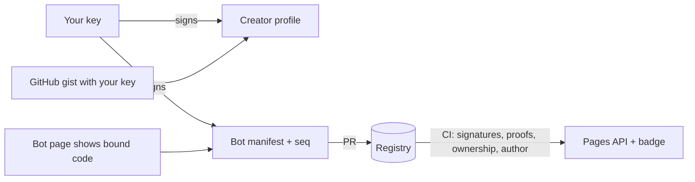

# How verification works

| Label | Means |
|---|---|
| **self-claimed** | Signed by the creator; bot control not shown |
| **challenge-passed** | The bot's own page shows `botproof-challenge:<platform>/<botId>:<key>:<nonce>` |
| **platform-signed** | Challenge passed, and an allowlisted platform signed a request from the bot ([Web Bot Auth](platforms.md)) |
| **revoked** | The creator withdrew it |

**Score** = identity (linked accounts, weighted by GitHub account age) + ownership (the label) + reviews (other creators, weighted by their trust; self-reviews, reviews of earlier versions and reviews from accounts under 90 days count 0). `verify` prints every part.
